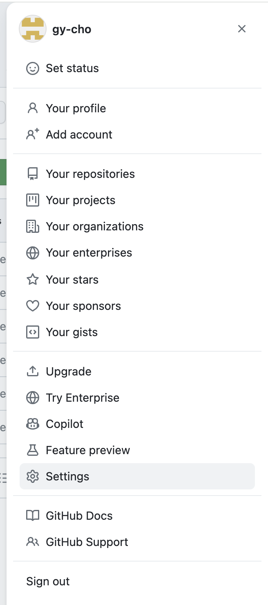
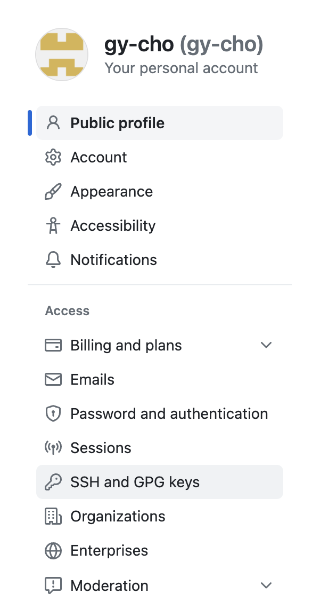
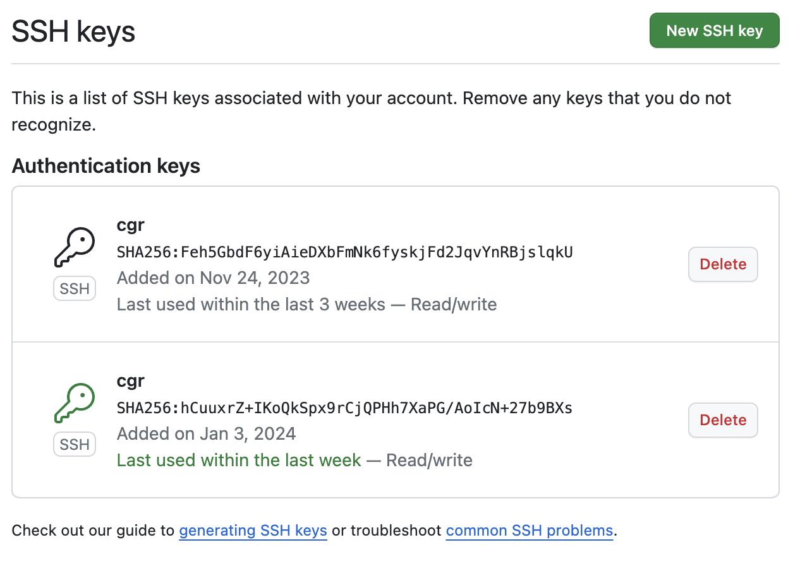
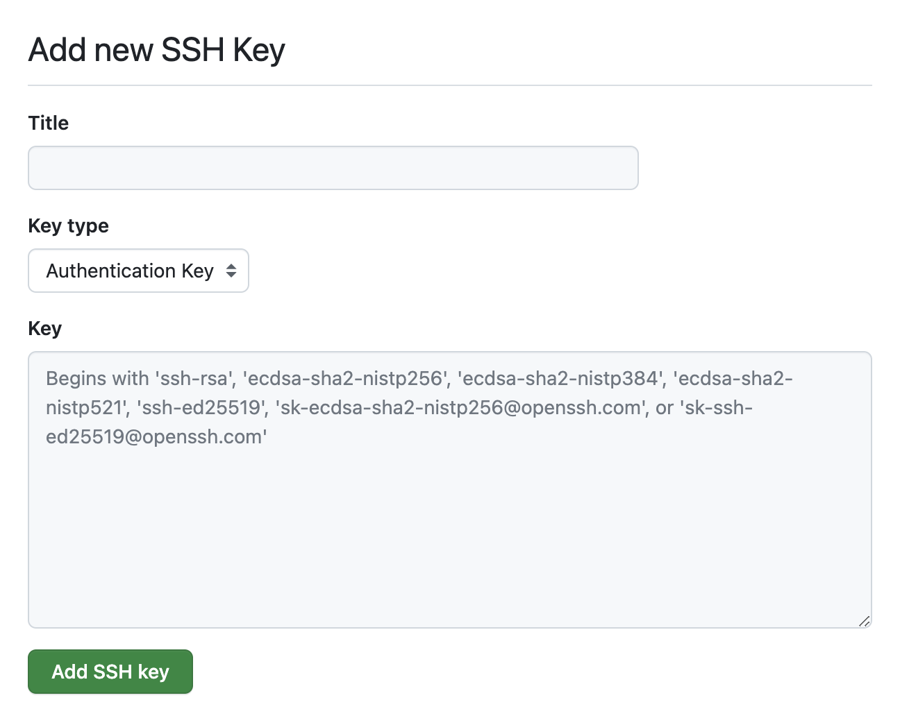
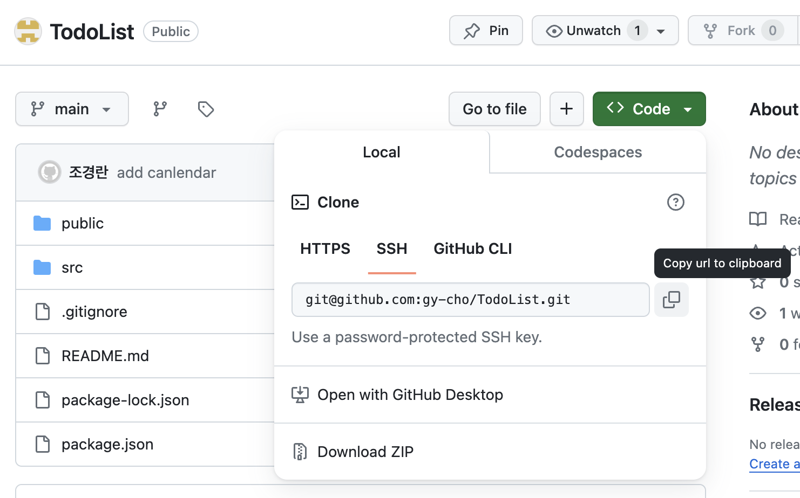

# SSH 등록해서 Git 계정 여러개 사용하기


하나의 컴퓨터에서 여러개의 git 계정을 사용해야 하는 경우가 있습니다. 그럼 프로젝트에 push 할 때마다 git config의 계정을 수정해줘야 합니다. 하지만 ssh 를 설정하면 각 프로젝트에 push 할 때 자동으로 내가 설정한 계정으로 push 할 수 있습니다.

## SSH Key 생성

ssh key 는 원하는 위치에 생성하면 됩니다. 여기선 `~/` 폴더에 생성했습니다.

`.ssh` 디렉토리를 생성합니다. 반드시 앞에 `.` 이 붙어야 합니다. `.ssh` 디렉토리로 이동해서 `ssh-keygen -t ed25519 -C “git 이메일 계정”` 명령으로 key 를 생성합니다.

```bash
$ mkdir .ssh
$ cd .ssh
$ ssh-keygen -t ed25519 -C “git@email.com”
Generating public/private ed25519 key pair.
Enter file in which to save the key (/Users/kido/.ssh/id_ed25519):  <-- 그냥엔터
Enter passphrase (empty for no passphrase):   <-- 그냥엔터
Enter same passphrase again:   <-- 그냥엔터
Your identification has been saved in /Users/kido/.ssh/id_ed25519.
Your public key has been saved in /Users/kido/.ssh/id_ed25519.pub.
The key fingerprint is:
SHA256:MMzpFz1s1Xdv/6ICpuSm05ueYpJ34 schooldevops@gmail.com
The key's randomart image is:
+--[ED25519 256]--+
|         ..o     |
|     o .o+. o    |
|      *o. =.     |
|.  o o+o.o .     |
...
|ooooo..   .o.    |
+----[SHA256]-----+
```

명령을 실행하면 `id_ed25519`와 `id_ed25519.pub` 파일이 생성된다.
:::tip
ssh key는 프로젝트 마다 하나씩 만들어야 합니다. key 이름을 프로젝트 이름과 통일시키면 관리에 용의합니다.
:::

## SSH Key 등록

### ssh-agent 활성화

```bash
$eval "$(ssh-agent -s)"
Agent pid 62393 // ssa-agent가 pid 62393으로 시작됨
```

### config 파일 설정
    - `~/.ssh/config` 파일에 다음 내용을 입력 (파일이 없으면 생성 $vi ~/.ssh/config)
    - 여러개 입력 가능

```
Host *
	AddKeysToAgent yes
  UseKeychain yes
  IdentityFile ~/.ssh/id_ed25519

Host code_nook
    AddKeysToAgent yes
    UseKeychain yes
    IdentityFile ~/.ssh/code_nook
```

### ssh-agent에 ssh 개인키 추가

```bash
$ssh-add -K ~/.ssh/id_ed25519

Identity added: /Users/kido/.ssh/id_ed25519 (git@gmail.com)
```

## Repository에 SSH Key 등록

이제 생성한 키를 github나 gitlab 등 프로젝트 저장소에 등록합니다.

### ssh key 복사

```bash
$pbcopy < ~/.ssh/id_ed25519.pub
```

### github에 ssh key 등록
**1. 키를 등록할 프로젝트를 선택 (없으면 새로운 Repository 생성)**

**2. `개인정보 > Setting` 클릭**


**3. `SSH and GPG keys` 클릭**

    
**4. `New SSH key` 클릭**

    
**5. 원하는 Title을 적고 복사한 key를 `Key` 에 붙여넣기**

    
**6. 비밀번호 입력창이 나오는데 자신의 git 비밀번호를 입력**

**7. Key 등록 테스트**

```bash
$ssh -T git@github.com

> The authenticity of host 'github.com (IP ADDRESS)' can't be established.
> RSA key fingerprint is SHA256:nThbg6kXUpJWGl7E1IGOCspRomTxdCARLviKw6E5SY8.
> Are you sure you want to continue connecting (yes/no)? yes <-- 입력하고 엔터 

Hi schooldevops! You've successfully authenticated, but GitHub does not provide shell access.
```

## SSH로 PUSH



Repository 에서 ssh 주소를 복사하고 원하는 폴더 위치에서 `$git clone 'ssh git 주소'` 합니다. 이 폴더에서 git push 하면 설정한 git@gmail.com 로 자동으로 push 된다.