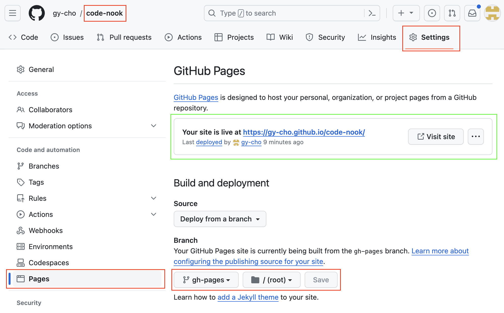
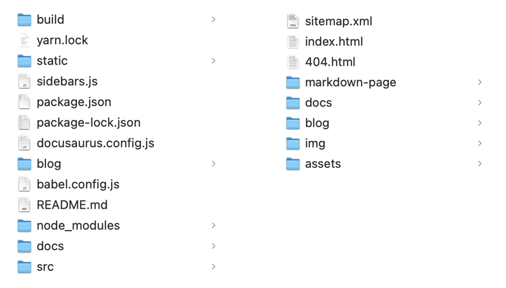
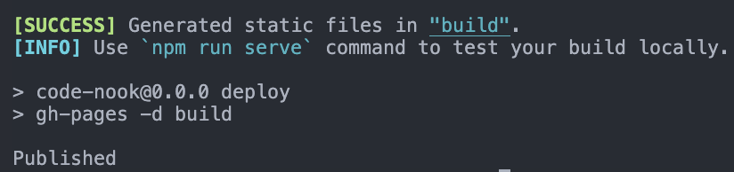
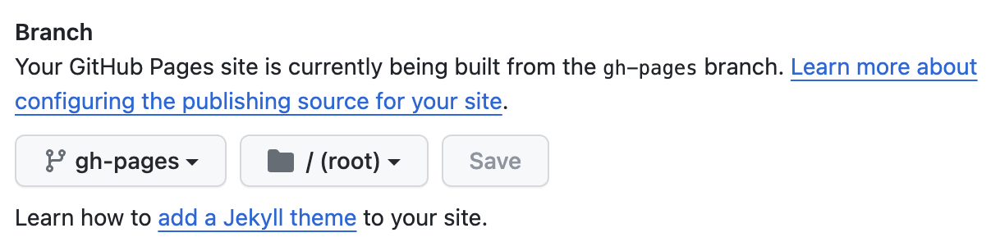

# Docusaurus 블로그 Github 호스팅

Docusaurus로 프로젝트를 만들었다면 인터넷에서 블로그에 접속할 수 있게 호스팅 해주어야 합니다. Github에선 Pages 라는 호스팅 서비스를 제공하고 있습니다. 우선 Github로 Pages를 시작하기 위해선 소스코드를 Git Repository를 만들어 push 해주어야 합니다. 이 글에선 Repository에 소스코드를 올리는 과정은 생략하고 설명하겠습니다.


## Git Pages 시작하기
호스팅 할 Repository에서 `Setting > Pages` 에 들어가면 아래와 같은 화면이 뜨는데요. 호스팅할 Branch 선택하고 `Save`를 누르면 내가 만든 페이지를 github 주소로 호스팅 할 수 있습니다.

호스팅에는 시간이 5~10분정도 걸릴 수 있고, 성공하면 녹색 박스처럼 호스팅 도메인이 상단에 표시됩니다. 



간단해 보이지만 Docusaurus 소스코드를 올린 Repository를 호스팅해도 정상적으로 호스팅 되지 않습니다. 보통 주소에 들어가도 README.md 파일의 내용이 뜨는걸 보게 될 겁니다.

Git에 올린 소스는 왼쪽 이미지 처럼 React 소스코드 일텐데, 실제로 내가 만든 화면을 호스팅 하려면 오른쪽 이미지 처럼 `build` 폴더의 파일들이 Repository 의 `/` 경로에 있어야 합니다. 하지만 build 폴더 용 Repository를 따로 만들어서 호스팅 해주기엔 매번 build 파일을 push 해주어야 하는 불편함이 있습니다.

 

**gh-pages** 패키지를 설치해서 이 문제를 해결할 수 있습니다.


## gh-pages 설치하기

다시 Docusaurus 프로젝트로 돌아와 gh-pages 를 설치해 줍니다.

```bash
npm install gh-pages
yarn add gh-pages
```

설치 되었으면 `package.json` 파일을 수정해야 합니다.

`homepage` 에 호스팅 될 도메인 주소를 입력해주고, `scripts` 에 아래 내용을 추가합니다.

Git pages 로 호스팅 하게 되면 다른 도메인을 설정하지 않는 한 기본 주소가 `https://[Git계정이름].github.io/` 으로 생성되게 됩니다. 따라서 `homepage` 에는 `https://[Git계정이름].github.io/[Repository이름]` 형식으로 작성합니다.

```jsx
{
	"homepage": "https://gy-cho.github.io/code-nook/",
	"scripts": {
		"predeploy": "npm run build",
		"deploy" : "gh-pages -d build"
	},
}
```

수정이 완료되었으면 git 원격저장소에 push 하고 프로젝트 폴더에서 `npm run deploy` 명령을 실행해주세요. 아래처럼 메시지가 뜨면 완료 됩니다.



다시 Git Pages 화면으로 돌아와 보면 `gh-pages` 라는 브랜치가 추가되어있을 거에요. 선택한 후 `Save` 를 눌러주면 내가 만든 블로그가 정상적으로 호스팅 된 걸 볼 수 있습니다.




## 수정사항 Git 반영

코드를 수정해서 블로그에 반영하고 싶으면, main branch에서 소스코드를 수정 후 프로젝트에서 아래 명령을 실행해주면 자동으로 블로그에 수정사항이 반영됩니다.

꼭 build 후 deploy 해주어야 수정사항이 반영됩니다!

```bash
npm run build
npm run deploy
```